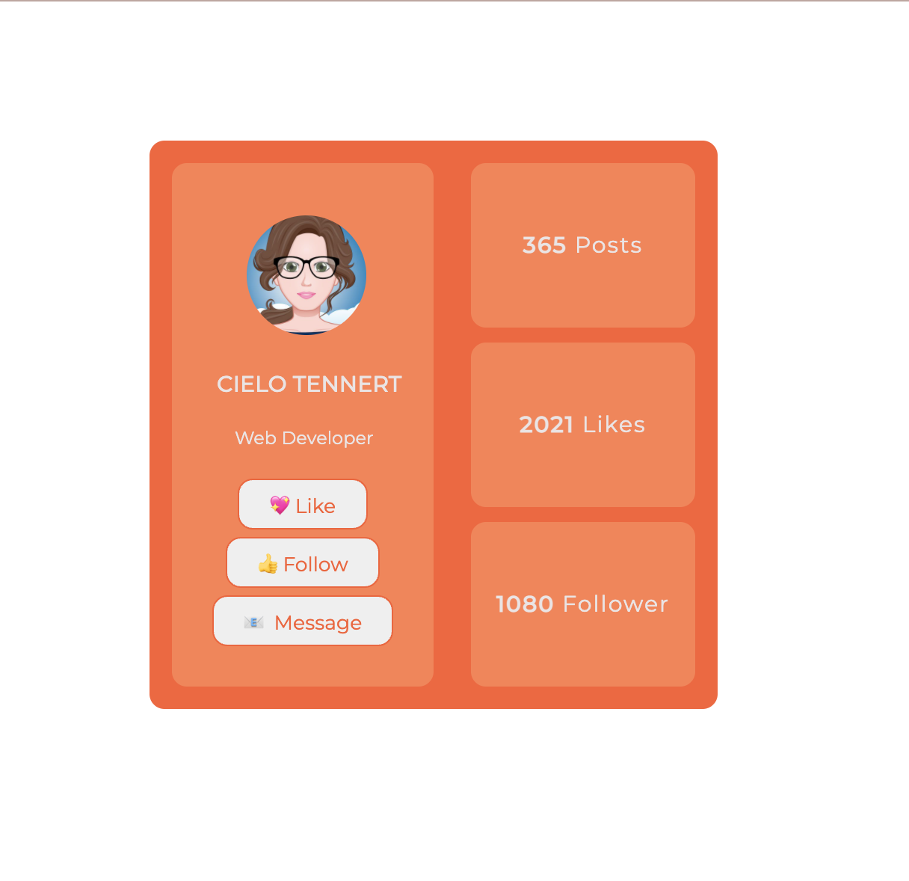
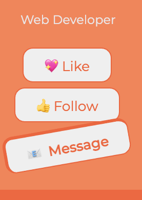
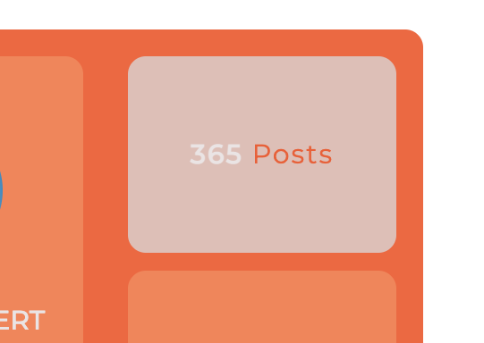

# Домашнє завдання 4

Зробити по макету:

**ВАЖЛИВО** 

Намагайтеся відтворити дизайн максимально точно до картинки, якщо знаєте flex, можете робити за допомогою нього, але ми ще цього не проходили

**Вимоги до виконання:**

1. Блок повинен бути по центрі екрану
2. Підключіть шрифт і використайте його - @import url("https://fonts.googleapis.com/css2?family=Montserrat:wght@100;200;300;400;500&display=swap")
3. Блок повинен складатися з двох частин, перша опис профілю, друга статистика, досягти цього можна за допомогою float(https://learn.javascript.ru/float)
4. В першій частині profile - повинна бути фотографія профілю - ось посилання на фото - https://i.pinimg.com/474x/82/ab/35/82ab3533ee71daf256f23c1ccf20ad6f--avatar-maker.jpg
5. При наведенні на картинку вона повинна обертатися на 360 градусів
6. Блок із діями(like, follow, message) - іконки замінити на інші з https://fontawesome.com/v5.15/icons, іконки повинні бути виконані за допомогою тегу button(https://www.w3schools.com/tags/tag_button.asp)
7. При наведенні на кожну дію - збільшується border, font-weight, відбувається rotate

8. Друга частина блоки із статистикою повинні бути одного розміру
9. При ховері на них змінюється background, та колір тексту

